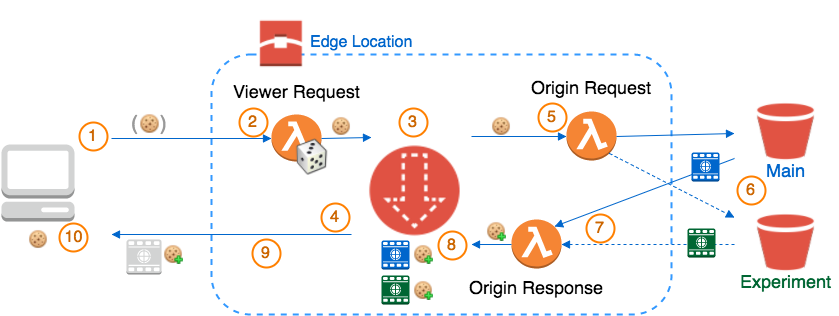

# A/B testing with CloudFront & Lambda@Edge

Example code for implementing A/B testing on CloudFront using Lambda@Edge.

Particularly, switching between different versions of content is done by the CDN, as opposed to other solutions doing it client side, or server side. These solutions imply either modifying the client or server code. Something that might be not advisable or not possible,

**This is not a complete solution**.

Setup and deploy is manual, confifiguration is hardwired in Lambda function codes.

## Scenario

You have a website or any static content.

Static content served by an S3 bucket.
Serving the content by S3 is not actually a contraint. The real constraint is the system seving the content does not handle cookies and has no intelligence for handling separate versions of the content, or you do not want to/cannnot modify it to support testing of multiple versions.

Content is cached by AWS CloudFront CDN.

Your goal is doing A/B testing or Canary deployment testing: part of the traffic is diverted to a different version. For proper A/B testing is 50-50%, but may be any fraction.

You are testing between two (or more) different, **complete** versions of the entire content (not a single element, e.g. the image of the logo).
Let's call them *main* and *experiment*. There might be multiple experiments as an extention.

Each version of the website is served by a separate URL (e.g. a separate S3 Bucket). They are configured as different *Origins* in the CloudFormation Distribution.

You want to have a user sticking on the same version of content for the duration of her/his "browser" session(remember there is no login.
You do not want to have content randomly served from diferent versions at each request.

## How it works

We want to keep the served version stable with a cookie, `X-Source` (but the cookie name may be changed). 
As content is served by S3 bucket the cookie cannot be added by the server.
So the idea is adding a `Set-Cookie` to every response.

CloudFront caches both versions of the content.

Note that the solutions suggested by [this example](https://docs.aws.amazon.com/AmazonCloudFront/latest/DeveloperGuide/lambda-examples.html#lambda-examples-a-b-testing) and [this example](https://aws.amazon.com/blogs/networking-and-content-delivery/dynamically-route-viewer-requests-to-any-origin-using-lambdaedge/) require something external to set the cookie that decides the version. 
Otherwise, every request may get a different version of the content.

CloudFront has two Origins, one for the main version and another for the experiment.
By default, the main version is served, but Lambda@Edge may intercept requests and switch to a different Origin.

This is how serving a request works:



1. The browser request is directed to the closest CloudFront Edge location. The request may contain the `X-Source` cookie
2. The *Viewer Request* Lambda@Edge function check if the `X-Source` cookie is present. If not, rolls dice and dicides to decide which version and adds the cookie to the request, accordingly.
3. CloudFront Distribution decides whether it's a cache-it. The cache key is the object URI plus `X-Source` cookie.
4. A cache hit is served immediatly from the cache. It contains a `Set-Cookie` response header, cached along with the content (see below).
5. A cache miss is handed to the *Origin Request* Lambda@Edge function. If the `X-Source` target the Experiment, the Origin is changed to Experiment S3 Bucket, otherwise remain unchaged and goes to Main S3 Bucket.
6. The content is served by the selected Origin. S3 igores cookies.
7. The response (and the request) are passed back to the *Origin Response* Lambda@Edge function. It adds a `Set-Cookie` response header to make it sure the browser will send the correct cookie on following requests.
8. The decorated response, that includes the `Set-Cookie` response header, is cached by CloudFront Distribution. The cache will eventually contains both versions of the content with the corresponding `Set-Cookie` header.
9. The response is returned to the browser. 
10. The browser set the cookie and send it on every new request.


### Further information
* [Settings and configuration](docs/settings.md): more details about configurations.
* [Lambda functions](docs/lambda-functions.md): more details about functions.
* [Switching A/B testing on and off](docs/switching-testing.md): how to switch on and off A/B testing in production, without impacting users.

## Useful docs and examples

Documentation is quite sparse. Examples are naive...

* [AWS Lambda Developer Guide - Lambda@Edge](https://docs.aws.amazon.com/lambda/latest/dg/lambda-edge.html)
* [AWS CloudFront Developer Guide - Lambda@Edge](https://docs.aws.amazon.com/AmazonCloudFront/latest/DeveloperGuide/lambda-at-the-edge.html)
* [AWS Lambda@Edge docs - Example: A/B Testing](https://docs.aws.amazon.com/AmazonCloudFront/latest/DeveloperGuide/lambda-examples.html#lambda-examples-a-b-testing)
* [Dynamically Route Viewer Requests to Any Origin Using Lambda@Edge](https://aws.amazon.com/blogs/networking-and-content-delivery/dynamically-route-viewer-requests-to-any-origin-using-lambdaedge/)
* [How to supercharge your static website with the power of AWS Lambda@Edge](https://read.acloud.guru/supercharging-a-static-site-with-lambda-edge-da5a1314238b)


## Known issue of Lamnda@Edge

[Replicated Lambda@Edge cannot be deleted](https://forums.aws.amazon.com/thread.jspa?threadID=260242) (i.e. Lambda associated with CloudFront Distributions as Lambda@Edge).

At the time of writing, you have to remove the trigger from the CloudFront Distribution and wait untile the function is completely removed from the CDN, before being able to delete the Lambda.
I saw it takes between 30 mins to 24 hours and AFAIK there is no way of checking the state with AWS CLI or Console. So you may just wait and retry.

Note that this issue practically prevents from using any stateful infrastructure automation tool to deploy Lamda@Edge, like [Terraform](https://github.com/terraform-providers/terraform-provider-aws/issues/1721), unless you completely separate deployment of Lambda function and attaching them to CloudFront triggers.

## Some gotchas!

At the time of writing (15-Feb-2018) the documentation about Lambda@Edge is very sparse, to use an euphemisim, and all examples are trivial.

Here are some gotchas I got breaking my head in a cut&try process.
Note that some of them might not be true in the future, as Lambda@Edge are rapidly evolving.

#### Only N.Virginia AWS Region

Lambdas must be created in `us-east-1` Region to be used as Lambda@Edge.

#### No environment for Lambda@Edge

As described in the [CloudFront Developer Giude](https://docs.aws.amazon.com/AmazonCloudFront/latest/DeveloperGuide/lambda-requirements-limits.html#lambda-requirements-lambda-function-configuration) Lambda@Edge do not support Environment Variables.

The strong implication is you cannot parametrise functions. Every parameter should be hardwired in the code you deploy.

#### Only numbered Lambda versions

Only numbered-versions of Lambda may be attached to CloudFront (i.e. no `$LATEST`).
So, a Lambda must be publised before being able to attach it to a CloudFront Behaviour event.

#### Logs from Lambdas

Lambda@Edge logs go to CloudWatch as all Lambda logs.

Remember to be used as Lambda@Edge Lambda functions must be in the `us-east-1` Region.

While testing a Lambda from the Console (using the "Test" button), logs always go to `us-east-1` to a *Log Group* named `/aws/lambda/<function-name>`.

When running on CloudFront, Lambda@Edge runs at Edge Locations. 
Logs go to the Region of the Edge Location hit by the browser, to a *Log Group* named `/aws/lambda/us-east-1.<function-name>`.

The actual Edge Location being used is not obvious and it is not necesarily the one closed to the client location. 
It may also change from time to time and logs may end up in a different Region. For example connecting from London I usually hit an Edge Location in West London (LHR), but it happened to be randomly routed to Amsterdam (AMS). The result was logs were part in `eu-west-1` and others in `eu-central-1`.

#### Switching Origin from Lambda@Edge

If you dynamically change the Origin of a request, you also have to change the `Host` header in the request, to match the new origin S3 Bucket name.

If the `Host` header does not match the actul Origin, CloudFront reject the request with an error: *“The request signature we calculated does not match the signature you provided”*

Also, apparently Origin may ba changed only in *Origin Request* triggers, not in *Viewer Requests*. So the response get cached.
Be sure to use a cache key that includes the element you used to decide the Origin.
This bring to the following gotcha...

#### Forwarded Cookies are part of CloudFront cache key

When you forward Cookies to the Origin (part ot CF Distribution Behaviour settings), these cookies become part of the cache key of the object, along with the URI.
Regardless the backend Origin is ignoring cookies (e.g. S3).

If you are using a Cookie to decide the Origin, this cookie must be forwarded to the Origin as *Whitelist*.

Never forward *All* cookies, or cache will become useless.

#### Cache invalidation drops all versions of an object, regardless of forwarded cookie

Even when the Distribution is set up to forward Cookies and use them as part of the cache key, you [cannot selectively invalidate a version of an object based on the cookie](https://docs.aws.amazon.com/AmazonCloudFront/latest/DeveloperGuide/Invalidation.html#invalidation-specifying-objects-forwarding-cookies).
Invalidation is based on object URI only.

#### Headers are part of the cached content

Response Headers returned by the Origin are cached along with the content.

Headers added or modified by *Origin Response* Lambda@Edge functions will be cached.

#### Wait for full propagation of the CloudFront Distribution before testing a change in Lambda@Edge

While the Distribution is still propagating, you never know if you are triggering the old or newer version of a Lambda atteched a trigger.

Wait for full propagation before any testing.

This AWS CLI command may be useful to be sure the Distribution is settled down:
```
$ aws cloudfront wait distribution-deployed --id <distributionID> && echo READY
``` 